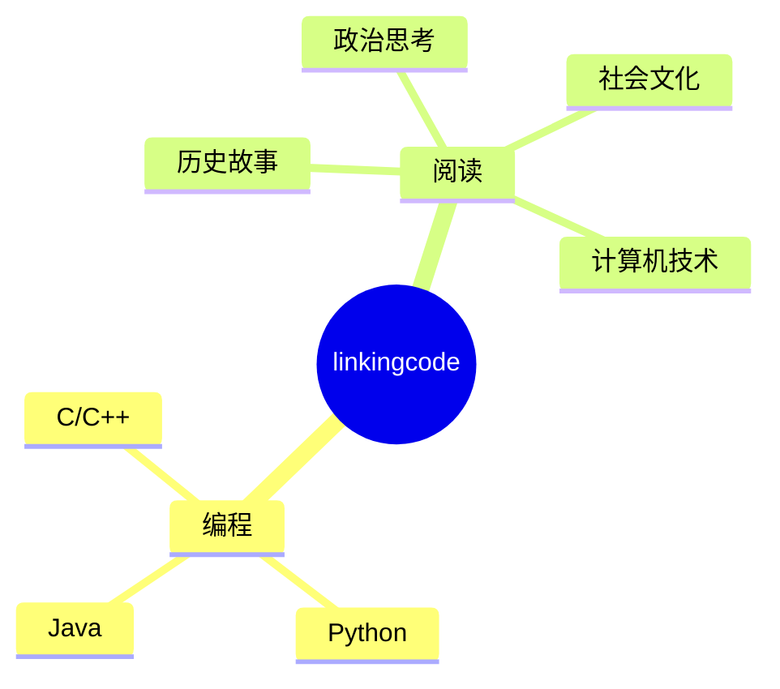

<div align="center">
  
  <!-- dynamic typing effect 动态打字效果 -->
  <div align="center">
      
    </a>
  </div>

  <!-- profile logo 个人资料徽标 -->
  <div align="center">
    <a href="https://space.bilibili.com/3493135164377654/"></a>&emsp;
    <a href="https://blog.csdn.net/linkcoder?spm=1000.2115.3001.5343"></a>&emsp;
    <a href="   https://juejin.cn/user/512809594808781"></a>&emsp;
    <a href="https://www.zhihu.com/people/66-53-49-52"></a>&emsp;
  </div>

<!-- Snake Code Contribution Map 贪吃蛇代码贡献图 -->
<picture>
  <source media="(prefers-color-scheme: dark)" srcset="https://cdn.jsdelivr.net/gh/sun0225SUN/sun0225SUN/profile-snake-contrib/github-contribution-grid-snake-dark.svg" />
  <source media="(prefers-color-scheme: light)" srcset="https://cdn.jsdelivr.net/gh/sun0225SUN/sun0225SUN/profile-snake-contrib/github-contribution-grid-snake.svg" />
  
</picture>

</div>

#  🙋 Hello

<table>
<tr><td>

<!-- About me 关于我 -->
### 🤺 About Me


<p>&emsp;&emsp;Hello,my name is linkingcoder，</p>
<p>&emsp;&emsp;热爱编程、读书、运动。</p>
<p>&emsp;&emsp;我们正在让这个世界变得更加美好，通过代码的重复使用和延展构建完美体系。</p>
<p><strong>&emsp;&emsp;We're making the world a better place. Through constructing elegant hierarchies for maximum code reuse and extensibility.</strong></p>

</td></tr>

<tr>
<td>
<!-- wakatime 统计 -->
### 📊 WakaTime

<picture>
  <source
    srcset="https://github-readme-stats.vercel.app/api/wakatime?username=linkingcoder&layout=compact&text_color=f0f6fc&bg_color=00000000&hide_border=true&hide_title=true"
    media="(prefers-color-scheme: dark)"
  />
  <source
    srcset="https://github-readme-stats.vercel.app/api/wakatime?username=linkingcoder&layout=compact&text_color=1f2328&bg_color=00000000&hide_border=true&hide_title=true"
    media="(prefers-color-scheme: light), (prefers-color-scheme: no-preference)"
  />
  
</picture>

</td></tr>

<tr><td>

<!--START_SECTION:waka-->
**I'm an Early 🐤** 

```text
🌞 Morning                548 commits         ██████░░░░░░░░░░░░░░░░░░░   24.94 % 
🌆 Daytime                704 commits         ████████░░░░░░░░░░░░░░░░░   32.04 % 
🌃 Evening                641 commits         ███████░░░░░░░░░░░░░░░░░░   29.18 % 
🌙 Night                  304 commits         ███░░░░░░░░░░░░░░░░░░░░░░   13.84 % 
```
📅 **I'm Most Productive on Friday** 

```text
Monday                   261 commits         ███░░░░░░░░░░░░░░░░░░░░░░   11.88 % 
Tuesday                  195 commits         ██░░░░░░░░░░░░░░░░░░░░░░░   08.88 % 
Wednesday                310 commits         ████░░░░░░░░░░░░░░░░░░░░░   14.11 % 
Thursday                 258 commits         ███░░░░░░░░░░░░░░░░░░░░░░   11.74 % 
Friday                   662 commits         ████████░░░░░░░░░░░░░░░░░   30.13 % 
Saturday                 187 commits         ██░░░░░░░░░░░░░░░░░░░░░░░   08.51 % 
Sunday                   324 commits         ████░░░░░░░░░░░░░░░░░░░░░   14.75 % 
```


📊 **This Week I Spent My Time On** 

```text
🕑︎ Time Zone: Asia/Shanghai

💬 Programming Languages: 
Markdown                 9 hrs 48 mins       ████████████░░░░░░░░░░░░░   47.74 % 
Vue.js                   5 hrs 25 mins       ███████░░░░░░░░░░░░░░░░░░   26.43 % 
TypeScript               2 hrs 17 mins       ███░░░░░░░░░░░░░░░░░░░░░░   11.17 % 
JSON                     1 hr 11 mins        █░░░░░░░░░░░░░░░░░░░░░░░░   05.84 % 
Other                    1 hr 4 mins         █░░░░░░░░░░░░░░░░░░░░░░░░   05.26 % 

🔥 Editors: 
VS Code                  18 hrs 57 mins      ███████████████████████░░   92.22 % 
Obsidian                 1 hr 29 mins        ██░░░░░░░░░░░░░░░░░░░░░░░   07.29 % 
IntelliJ                 6 mins              ░░░░░░░░░░░░░░░░░░░░░░░░░   00.49 % 

💻 Operating System: 
Windows                  19 hrs 1 min        ███████████████████████░░   92.55 % 
Mac                      1 hr 31 mins        ██░░░░░░░░░░░░░░░░░░░░░░░   07.45 % 
```


 Last Updated on 12/08/2023 01:07:44 UTC
<!--END_SECTION:waka-->
  
</td></tr>
</table>

<!-- ########################################## 分割 ########################################## -->


<div align="center" >



<!-- just img 图片 -->


<!--  skill badge 技能徽章 -->
💪 正在学习


  
🧠 计划学习


🧰 常用的工具


<!-- programming tool icon 编程工具图标 -->
<br>

<!-- svg -->


 


<br>

<!-- gif -->


<!-- just img 图片 -->
</div>

<!-- profile-3d-contrib 3D贡献图-->

</div>

<!-- ########################################## 分割 ########################################## -->


<div align="center" >

<!-- Github-Stats-Terminal 终端风格信息 -->
<br>
  
<!-- Quotes 名人名言 -->
<br>
  
<!-- GitHub 奖杯🏆 -->
<br>

<!-- GitHub 数据统计 -->

<br><br>
  
<!-- Wakatime Graph-->
<table>
  <tr>
    <td></td>
    <td></td>
  </tr>
  <tr>
    <td colspan="2"><a href="https://run.sunguoqi.com"></a><br></td>
  </tr>
</table>
</div>

<!-- ########################################## 分割 ########################################## -->


<div align="center">

<!-- run 图片 -->


<!-- Joke 笑话 -->
<div></div>

<!-- github-readme-streak-stats 连续提交代码天数记录 -->
&emsp;

&emsp;

<!-- metrics 基础资料 -->
&emsp;

&emsp;

<!-- GitHub Activity Graph GitHub 活动图 -->
<table align="center">
  <tr>
    <td></td>
  </tr>
</table>

</div>

<!-- ########################################## 分割 ########################################## -->

<!-- GitHub metrics 信息指标 -->
<div align="center">

<!-- just img 图片 -->


<!-- first form 第一个表格 -->
<table>
  <tr>
    <td></td>
  </tr>
</table>

<!-- second form 第二个表格 -->
<table>
  <tr>
    <td></td>
    <td></td>
  </tr>
  <tr>
    <td></td>
    <td></td>
  </tr>
  <tr>
    <td></td>
    <td></td>
  </tr>
  <tr>
    <td></td>
    <td></td>
  </tr>
  <tr>
    <td></td>
    <td></td>
  </tr>
  <tr>
    <td></td>
    <td></td>
  </tr>
</table>


<!-- just img 图片 -->

</div>
